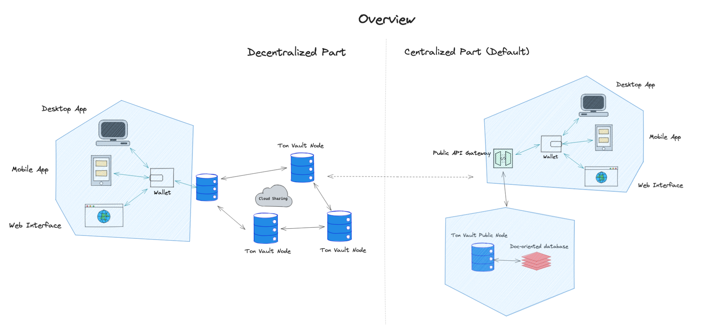

# Architecture Overview

> From a bird's eye view project represents a distributed database of secrets, based on the peer-to-peer (P2P) interaction of nodes. Any participant, if they wish, can launch their own Ton Vault Node and store secrets within it.

> If users launch their own node, they can synchronize their data with a public server, provided by the Ton Vault team (a paid feature) or with any other Ton Vault Node.

> Each client has the right to customize the interface (whether web or application) to interact with their personal storage. By default, however, the application will be synchronized with the public API.

> The encryption/decryption layer is entirely built upon the user's selected TON Wallet.

> Utilizing the Ton Storage protocol and an additional encryption layer, users can exchange data amongst each other, thereby creating a decentralized cloud.

> Check our [roadmap](roadmap.md) for features that are currently in development.